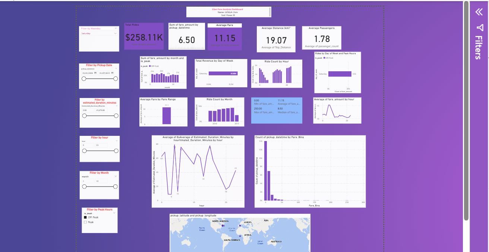
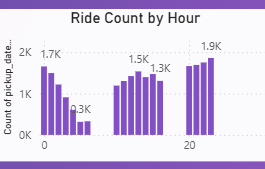
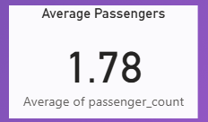
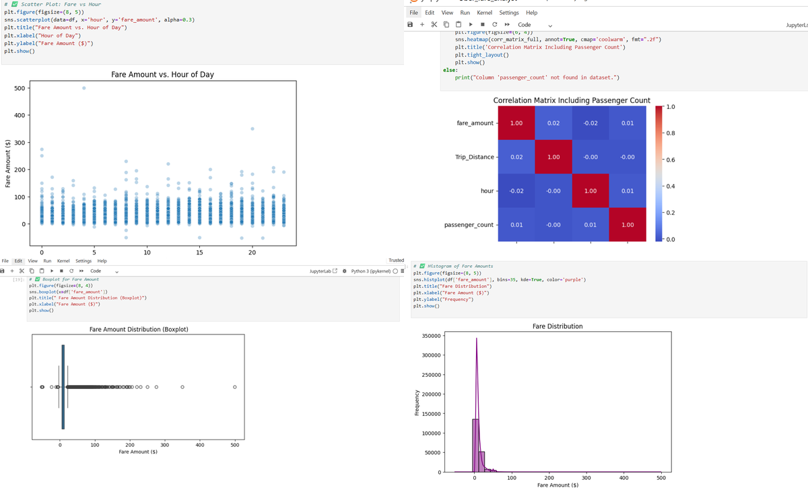

# 🚕 Uber Fare Analysis Dashboard

## Introduction to Big Data Analytics   

**Names**: Chris Genga
**ID**: 27344  
**Tooling**: Python (Jupyter), Power BI  
**Dataset**: [Uber Fares Dataset (Kaggle)](https://www.kaggle.com/datasets/yasserh/uber-fares-dataset)

---

## 📌 Introduction

The objective of this project is to explore and analyze Uber fare data to uncover key ride patterns, fare behaviors, and temporal trends. The insights are visualized using a Power BI dashboard to support data-driven decision-making in ride-share operations.

---

## 🧪 Methodology

### 1. Data Collection
- Dataset: Uber Fares Dataset (from Kaggle)
- Loaded into a Pandas DataFrame using Python

### 2. Data Cleaning
- Removed missing values using `dropna()`
- Converted `pickup_datetime` to proper datetime format
- Removed invalid timestamps

### 3. Feature Engineering
- Extracted time features:
  - Hour, Day, Month
  - Day of the week
- Created **Peak vs Off-Peak** indicator based on ride time

### 4. Exported Cleaned Data
- Saved as `uber_cleaned.csv` for Power BI import

---

## 📊 Analysis & Visualizations

### Power BI Visualizations Included:
- Total rides and total revenue KPIs
- Average fare, distance, and passengers
- Fare by:
  - Hour of day
  - Day of week
  - Fare range
- Ride count by hour and month
- Correlation heatmaps and box plots
- **Peak vs Off-Peak** ride breakdown
- **Map** showing geographic pickup points

### 🔹 Busiest Ride Hours

The chart below illustrates the number of Uber rides distributed across each hour of the day.

**Insight:**  
The busiest periods for Uber rides occur during the evening hours, specifically between **6 PM and 9 PM**, followed by a secondary peak in the early morning hours around **6 AM to 9 AM**. These trends align with typical commuter rush hours, highlighting key periods of operational demand.

**Recommendation:**  
To optimize efficiency and service quality, Uber should consider deploying more drivers during these peak time blocks and potentially apply dynamic pricing models to manage high demand.

### 🔹 Average Passengers per Ride

**Insight:**  
The average number of passengers per Uber ride is approximately **1.78**, indicating that most trips are taken by individuals or small groups. This aligns with typical ride-sharing behavior in urban areas, where solo and two-person trips are common.

**Recommendation:**  
Uber could promote carpooling or group ride incentives to improve ride efficiency during high-demand periods, especially in congested city zones.

---

## 📈 Key Findings

- **Busiest Hours**: 16:00–20:00 shows highest ride demand
- **Peak Times**: Defined as 7–9 AM and 5–7 PM
- **Fare Behavior**:
  - Fare increases with distance
  - Weekdays and evenings show higher average fares
- **Geographic Concentration**: Most rides centered around NYC

---

## ✅ Results

- Clean and enhanced dataset used to build an interactive dashboard
- Trends and patterns clearly visualized
- Dashboard allows filtering by:
  - Hour
  - Month
  - Weekday
  - Peak vs Off-Peak

---

## 💡 Recommendations

- Optimize driver availability during peak hours (evenings, weekdays)
- Adjust fare pricing to account for hour-based demand surges
- Consider expansion strategies in under-served time blocks

---

## 📊 Exploratory Data Analysis

This phase explored the distribution and relationships of key variables like fare amount, trip distance, and time-based features.

- Analyzed central tendencies (mean, median, mode)
- Identified outliers using boxplots and IQR method
- Explored correlations between fare, distance, hour, and passenger count

### 🔍 EDA Visual Summary

Below is a combined view of key visualizations:

- Fare Amount vs Hour
- Correlation Matrix (with Passenger Count)
- Fare Boxplot (Outliers)
- Fare Distribution Histogram

Below is a combined view of key visualizations:

- Fare Amount vs Hour
- Correlation Matrix (with Passenger Count)
- Fare Boxplot (Outliers)
- Fare Distribution Histogram
